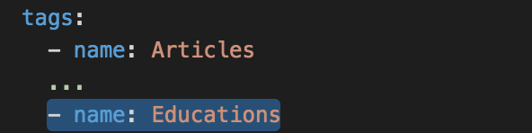

# Welcome to -->theLink<--


## What Is -->theLink<-- ? 

Experience is the best teacher.

Every project your company does, every task a person undertakes as they work to bring a project to life, contains valuable insight and lessons as to how to do things better.

This valuable experience forms the foundation of your organization’s knowledge. The challenge is that the lessons people learn as they do their work ends up being scattered across disconnected, difficult to use systems: thus these valuable lessons are often lost.

Menome Technologies Knowledge Discovery Platform –>theLink<– will help capture and retain those valuable lessons learned and bring them together so that they can be shared by all employees.

By connecting data and knowledge from the systems and documents your company uses using descriptions and terms your people are familiar with, –->theLink<–- makes it simple for those lessons to be shared and accessed by everyone in your organization, so that they can deliver the best possible project to your clients in the least amount of time, every time. Give your employees one place to go to easily access the experience your organization possesses to ensure everyone has the shortest distance between a question and the knowledge required to answer it.

We want to make the power of the Neo4j graph database accessible and easy to use for business by creating an enterprise friendly UI. 

## What Problem(s) Does It Solve?

Your business runs on information. Human resource systems, CRM, project management, ERP systems technical systems such as CAD: all of these contain critical information about your business.

You also have files, email, and spreadsheets scattered across file shares, or systems like Dropbox, one drive, iCloud, Google docs.

The challenge is they all have their own way of describing your business, and none of them will talk to each other.

Your people know where the information they need is stored, and they know how to get what they need to do their jobs, but it is difficult, it is slow and this knowledge is not shared, captured or written down anywhere.

The valuable knowledge and insight your organization should possess is scattered and fragmented across disconnected silos, and the way to get at it exists in only in the minds of your employees.

Menome Technologies helps you see the business the way your people do - not the way your systems do.

We don't replace your existing systems, we connect them and bring the valuable knowledge they contain together using your language and terminology. We make it easy for people to find and discover the knowledge that your organization possesses. 

We capture the hidden web of knowledge that your organization possesses, and we make it real.

Our process:

1. Interview People in your organization to find out how they organize their work, their communications and correspondence and where the knowledge they need to do their job is stored and is organized
2. We create a map  of how people really see the way knowledge they need to do their jobs is organized 
3. We bring the map to life by creating a knowledge web in theLink 
4. Connect the knowledge web to your existing systems

We find the hidden web that right now exists only in the minds of the people who work at your organization. How they name files, what they call the places where work is done, how they organize and classify the work they do, how the keep track of email, conversations and correspondence with clients, and the relationships that connect all of these.

We build a map of this, and then using our knowledge discovery platform -->theLink<--, and we bring this map to life so that everyone in the organization can use this knowledge web to make your business better.

The way your company's information is organized and stored lives in the minds of your employees. 

Menome technologies helps you makes that web of knowledge real.

1. Find information about entities and how they are related.
2. Ask questions about those entities and relationships.

### Basic Terminology

**Index Card:** an Index Card is the smallest amount of information required to describe something. Almost anything can be an Index Card; Person, Client, Company, Project, Report, etc...


**Link:** a Link describes how two Index Cards are connected. For example: a person _isAnEmployeeOf_ a company.


**Question:** describes a path through a series of Links between two Index Cards. 


## Who is this Documentation For?

Developers that are interested in -->theLink<-- should read this to understand how to get it up and running in a development / testing environment. We will describe the underlying technology, tools needed and how to customize -->theLink<-- interface to fit your data.

Most of the tools used are well documented and we recommend that anyone interested in developing -->theLink<-- have a solid understanding of Git, Docker, NodeJS development and neo4j graph databases. Without a foundation in the use of these tools and techniques, it will be difficult to derive the maximum value from this project and your data.

## What Technology is -->theLink<-- Built On?

-->theLink<-- is just the tip of the iceberg when it comes to visualizing your data. What entities you choose to surface, the relationships you create, the questions you want to ask are entirely up to you!

The main components that comprise -->theLink<-- are:

- a database host (Neo4j)
- a NodeJS API layer (Swagger)
- a NodeJS Web layer (Angular)

## Developing -->theLink<--

###What Tools Do I Need?

- A [GitHub account][GitHub link]
- [Docker](www.docker.com)
- An IDE (we use [Visual Studio Code](https://code.visualstudio.com))
- A Swagger editor (there's a great Docker container that we use for this)

###How Do I Get it Running?

Clone -->theLink<-- master branch from the [GitHub repository](https://github.com/menome/theLink). To avoid pathing issues is should go in /Users/$USER/Development/github/theLink on your filesystem.

>NOTE: There may be some volume mapping changes required at this step, particularly if you are using a Windows machine. See the _Known Issues_ section for more information.

```
1. Start Docker and open a Terminal window
2. Change to theLink directory
3. Run 'docker-compose build'
4. Run 'docker-compose up'
```

Once all the containers have started, switch to your browser (we use [Chrome](https://www.google.com/chrome/) because it has nice developer tools) and open three tabs.

1. [http://localhost:3050/docs/](http://localhost:3050/docs/) - This should show you the entities available for -->theLink<-- API generated by Swagger.
  
2. [http://localhost:8476/](http://localhost:8476/) - Your Neo4j instance. This will need some configuration before you can continue, but we'll get to that shortly.
  
3. [http://localhost:3050/](http://localhost:3050/) - -->theLink<-- web application. Once the database is set up you'll be able to register and login.
  

>NOTE: If you want to look at the inside of any container (such as the neo4j database host) use ```docker exec -ti <containerName> /bin/bash```.

####Setting up the Neo4j database

In your [http://localhost:8476/](http://localhost:8476/) browser tab, get your database ready by setting the default password to ```neo4j```. When prompted for a new password enter ```graphPaper!``` twice and you're ready to populate it with some spiffy data.

Your blank database should look like this:


In order to get some data into our database, there's a script we need to run. This will generate some test data that you can use to ensure that -->theLink<-- web interface is running. With the containers all running, open a second Terminal window.

```
1. Change to the theLink/neo4j directory
2. Run 'sh populate_neo4j_db.sh'
```
> TODO: scrub real people out of here

> NOTE: You might need to allow your terminal to talk to your containers before you can execute the shell script. Enable this by executing the command ```eval docker env``` in the Terminal.

After they've run you can go back to [http://localhost:8476/](http://localhost:8476/) and verify that your nodes and relationships have updated appropriately. You should see something like this:


#### Verify -->theLink<-- Web Application

Go back to [http://localhost:3050/](http://localhost:3050/) and register for an account. You can use any email address you like to register, even if it doesn't exist. Click around and you should see some of our imported data in the user interface, such as Topics.


### Debugging the Web and API Code

You can debug the application by connecting to the appropriate debug ports.

* -->theLink<-- API on port 5858
* -->theLink<-- web project or port 5859

## How Can I Display My Data in -->theLink<--?

-->theLink<--'s web interface is really just the tip of the iceberg. The data that you put into is is truly where its power lies. By creating nodes and relationships between them in your neo4j graph database, you can display almost any data in -->theLink<-- that you want.

### Creating Nodes

Your nodes can be whatever you want them to be, and can come from almost anywhere you want. The following examples will assume you are creating comma-separated value text files to use for importing your data. At a minimum, all nodes should have a UUID and a name.

Let's start with a simple Education node. It has a Name, UUID and Institution, but could have any number of additional fields. Our CSV file would look something like this:

```
Name,Uuid,Institution
Bachelor of Applied Science,6d24fde0-1117-4387-a16d-22aef789a116,McGill
Bachelor of Architecture,75345090-4e10-4ca7-8390-905f53857385,Yale
Bachelor of Science,f038414e-8323-4a31-a78d-4194a7616a3d,University of Calgary
```

Now you'll be able to create a cypher statement in your browser's neo4j query editor window to import your new data. You'll have to ensure that the CSV file has either been copied into the container, or is in a mapped location available to the container. Here's an example query to import the data for our Education node.

```
// load NodeEducation.csv
USING PERIODIC COMMIT 1000
LOAD CSV WITH HEADERS FROM 'file:///NodeEducation.csv' AS line
CREATE (c:Education {
    Uuid: line.Uuid,
    Name: line.Name,
    Institution: line.Institution
});
```

When dealing with CSV files pay special attention to the contents of your string fields. Look out for commas in the data itself, or other escape characters that could cause errors when you try to import them. It's often a good practice to do a replace on fields that might contain these kinds characters.

Unlike MSSQL, Neo4j is case sensitive so be aware of this when exporting your data. Simple things like UUIDs having upper case letters won't match against the same UUID with lower case letters. If one of your imports isn't bringing in any data, or you're missing a field, double check that everything is typed correctly in your cypher statements, and that the exports are outputting the intended data.

### Creating Relationships

Entity nodes aren't very exciting without some relationships!

Let's assume we have some people in our database too, and some of those brilliant folks have degrees. In any case where you want to create a relationship, the CSV file will be a list of ID pairs. Like so:

```
EducationId,PersonId
7ccac886-200a-44e1-9dec-ea57cfc87b51,809923fd-e0a1-4d11-9584-0004d6c05303
87be0131-a3b6-4a1f-b17b-3d2606b6a9c9,f382ea4b-ad69-42e7-9b09-000baa52e02c
e4d341d7-ab98-4b3e-9b38-2b2af42f0864,4523f220-1ffa-4f83-9d14-000e882db8ce
```

Here's an example relationship for our Education Node:

```
// load Relationship: Person -> HasDegreeIn -> Education
USING PERIODIC COMMIT 1000
LOAD CSV WITH HEADERS
  FROM 'file:///RelationshipPersonHasDegreeInEducation.csv' AS line
MATCH (c:Person {Uuid: line.PersonId })
MATCH (a:Education { Uuid : line.EducationId })
MERGE (c)-[:HasDegreeIn]->(a);
```

Make sure that you run the cypher statement for the relationship *after* importing the nodes you're relating. If your nodes don't exist yet, there's nothing to relate together.

The MERGE line is the interesting part. This is where you give the relationship a name for Neo4j to use. They can be read almost like English: "Person c HasDegreeIn Education a."

Simple!

### Generating Alphabet or Date Groups 

After you've created your node and imported the data, make sure to run the ```generateAlphabetGroups.cql``` query. This will ensure that the nodes will show up in the alphabet groups, which will be necessary to display them in -->theLink<-- user interface.

Some of the nodes you create will have date information on them. For examples of how to create date/time relationships take a look at ```generateTimeTree.cql```.

### Cleaning Up

Neo4j does a great job of cleaning up duplicates, but you'll want to take care of some housekeeping, especially when testing imports. So let's make sure to clean up after ourselves. Here's how!

An example cypher statement to delete our Education node.

```
MATCH (n) OPTIONAL MATCH (n)-[r:HasDegreeIn]-() WITH n,r
DELETE r
RETURN count(r) as deletedRelationshipCount;
```

An example cypher statement to delete our Education node.

```
// now delete educations
MATCH (n:Education) OPTIONAL MATCH (n)-[r]-() WITH n,r
DELETE n,r
RETURN count(n) as deletedNodesCount;
```

Notice that in this case we want to delete the relationship between nodes *before* trying to delete a node itself. This is just a smart thing to do. No point in having phantom relationships floating around in your database to trip you up later.

###Displaying Custom Information in -->theLink<--

#### Overview of -->theLink<-- User Interface

We want to add our education node as an Index card on the left hand side, and get the relationship from people to education into the Pivots on the right hand side. Creating and displaying questions is much more complicated, so we'll address that process later.


####Update the API

There are several steps required to add information for the a node and its relationships to the API's service layer. -->theLink<-- uses Swagger to generate its API, so let's update that now.

1. In ```theLinkApi\api\swagger``` folder open the ```swagger.yaml``` file and copy all of the contents.
2. With Docker running open a terminal window and fire up a Swagger editor. There's a nice editor container available which you can run.

  ```
  docker pull swaggerapi/swagger-editor
  docker run -p 80:8080 swaggerapi/swagger-editor
  ```
  
3. Navigate to [http://localhost](http://localhost) in your browser, which will start the Swagger Editor from our new container. Create a new file and paste the contents from swagger.yaml into it. 

  >NOTE: Building an API with Swagger is an art unto itself, so we recommend you have a look at the [Swagger specifications](http://swagger.io/specification/) to make sure you have a solid understanding of what it does and how it works.
  
  First let's add a tag for our new node. It doesn't matter where it goes in the list.
 
  
  
  Next, under the _paths:_ header, let's add a path with a get operation for our new node.
  
  
  
  The editor will parse everything and tell us if we have any errors, which is super helpful! Once you're finished copy all of the text and paste it back into the ```swagger.yaml``` file in our project.
  
  >NOTE: You'll need to rebuild theLink_api container before any changes you've made will show up in the API layer. You can verify changes to the API by browsing to [http://localhost:3050/docs/](http://localhost:3050/docs/).

4. In ```theLinkApi\api\controllers``` folder, create a new file named ```educations.js```. Most of the code in here doesn't change much between nodes. Our new education node has no outgoing relationships of its own, so it is pretty simple.

  [Click here to view a sample file education.js file.](samples/educations.js)

  Wait! Remember how we created that relationship between people and educations a while back? Let's not forget to make that usable in -->theLink<-- user interface too!

5.  In the same folder, open the ```people.js``` file. We'll add some code to it to make the relationship data we imported earlier accessible.

  a. In the module.exports section, add another line ```getByEducation: getByEducation,```.
  
  b. At the end of the file, add a new function called getByEducation.
  
  ```
//Gets people based on education
function getByEducation(req, res) {
ehelper.getNodesByRelationship(req,res,thisNodeType,"HasEducationIn","Education");
}
```
  The getNodesByRelationship function is built into -->theLink<-- to make it easy for you to add new relationships you make into it without having to write tons of almost identical code over and over again. You're welcome!

#### Update the Model and Search Configurations

Now that you've got all the underlying pieces in place, you can start defining what appears in the actual UI. To define what nodes are searchable, and what pivots they have we'll add them to ```theLinkApi\helpers\models.js```.

1. Add "Education" as a new item to the nodeTypeList variable.
2. Add "HasDegreeIn" as a new extended property in the Person list (inside the extendedProperties variable.
3. Add a new item to the knownRelationships variable for the extended property, making sure that the extended properties for your new node match the relationship name you used in neo4j.

  ```
  HasEducationIn:  {
    fSingName: "qualification belonging to this {itemName}",
    fPluralName: "qualifications belonging to this {itemName}",
    rSingName: "item with this {itemName}",
    rPluralName: "items with this {itemName}"
  },
  ```

Finally we need to define what shows up in the sidebar when an entity is selected. This information is in the ```theLinkApi\config\search-config.js```, so we'll add our new node to the searchList variable.

```
{ //Educations
  name: "Educations",
  nodeType: "Education",
  api: "educations",
  dateSearchable: false,
  locationSearchable: false,
  listChildren: [
           
  ],
  textChildren: [
    { name: "name", displayName: "Education" },
  ]
},
```

>NOTE: The order of the entities in this file is not modified or sorted when rendered in the user interface. If you want to specify a custom order to the entities, this is where you'd do it. However, for the sanity of your users, we strongly recommend alphabetizing the entity list.

#### Displaying Items in -->theLink<-- User Interface

Adding all the data and API operations won't be any use if we can't see our new stuff in -->theLink<--. Configuring the UI display options now is a snap. Open ```theLinkWeb\app\src\theLink\TheLinkService.js``` and we'll get this finished up!

This file is where we define all the entities, how they behave and what they look like in the user interface. Taking a quick look through the various entities will give you a good idea of how to add your own, but here's an example on how to add our Education entity to the nodeTypes variable.

```
Education: {
      icon: "file",
      text: "Educations",
      api: "educations",
      getDisplayName: function(card) { return card.Name }
    },
```

Our entity doesn't have a summary defined, but if it did we could add it like so:

```
getDisplaySummary: function(card) { return card.Url; }
```

Lastly, if we had some additional information we wanted to display in the right hand panel we would add it like this:

```
getDisplayPairs: function(card) {
  var retObj = [
    displayPairWrapper('Published', card.DatePublished, true),
  ];
  return retObj;
}
```

For more information on how to do this, take a look at the definition for the **displayPairWrapper** function. Plenty of examples can also be found in ```theLinkWeb\app\src\theLink\TheLinkService.js```.

##Contribute

###Provide Feedback

>TODO: Figure out how people can submit feedback to Menome about -->theLink<--.

###FAQ

Known Issues:

>TODO: There are currently no automated tests on the UI. Some are ready but have not been checked in by _kaust_.

###Support

>TODO: Determine what support options Menome will be providing.

##License

>TODO: Add copyright and AGPL license information.

[GitHub link]:www.github.com