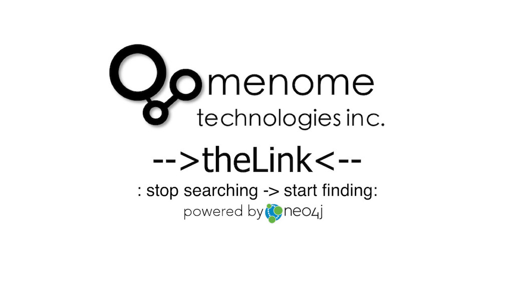

# Menome Technologies -->theLink<--#

Your business runs on knowledge. Human resource systems, CRM, project management, ERP systems technical systems such as CAD: all of these contain critical knowledge about your business.

You also have files, email, and spreadsheets scattered across file shares, or systems like Dropbox, one drive, iCloud, Google docs.

The challenge is they all have their own way of describing your business, and none of them will talk to each other.

Your people know where the knowlege they need is stored, and they know how to get what they need to do their jobs, but it is difficult, it is slow and this knowledge is not shared, captured or written down anywhere.

The valuable knowledge and insight your organization should possess is scattered and fragmented across disconnected silos, and the way to get at it exists in only in the minds of your employees. The goal of **-->theLink<--** is to bring your organizations critical knowledge together so that your employees can find the knowledge they need or the person they need to ask to make decisions quickly and easily. 

**-->thelink<--** doesn't replace your existing systems, it links the valuable knowledge they contain together using language and terminology that your business uses. **-->thelink<--** makes it easy for people to find and discover the knowledge that your business possesses. 

**-->thelink<--** is designed you see the business the way your people do - not the way your systems do.



