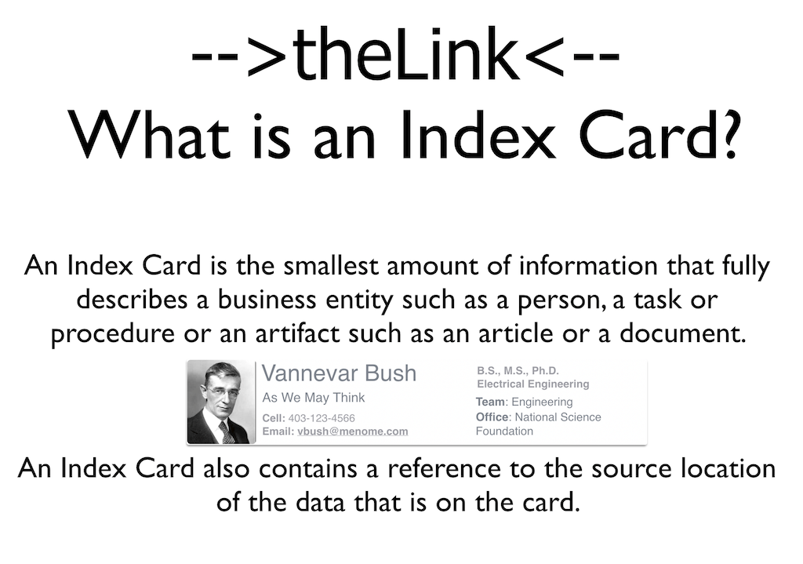
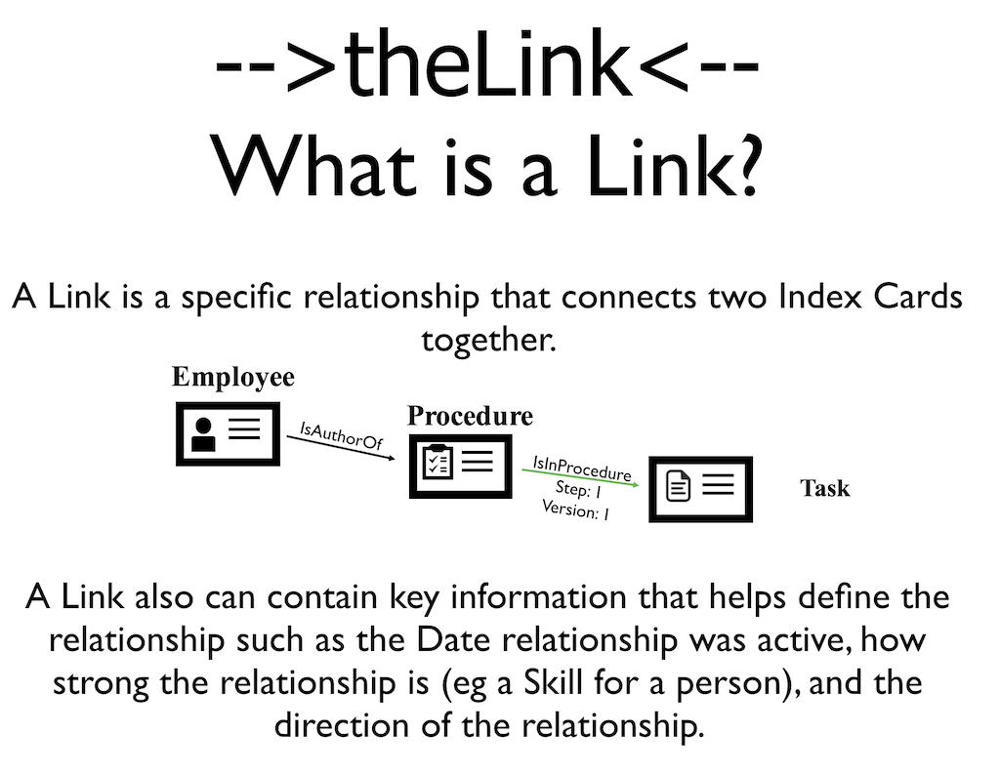

##Definitions:
       
 
**-->theLink<--** is made up of two key elements: **Index Cards** and **Relationships** between Index Cards.

An **Index Card** describes business entity such as a person, a project or a company. 

   
   
It can also describe knowledge articles, files or reports.
   
**Index Cards** are connected together with **Relationships**. For Example: *A Person is a Project Manager of a Project* is a type of relationship that would link a person to a project.

These Relationships link Index Cards together to form a **Knowledge Web** of your business critical knowledge.
    
**-->theLink<--** makes this Knowledge Web avaiable to you so that you can find what you need to make decisions.
    