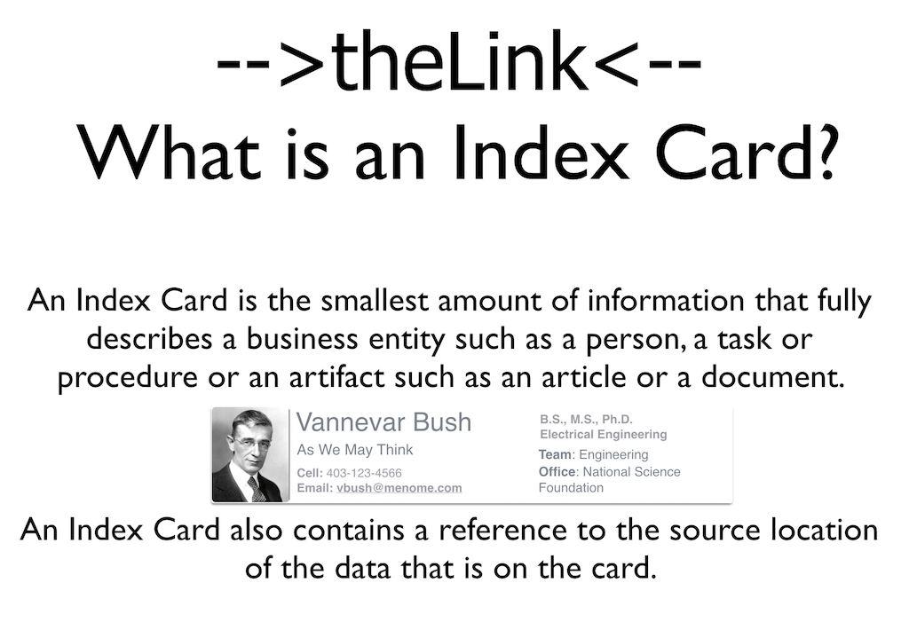
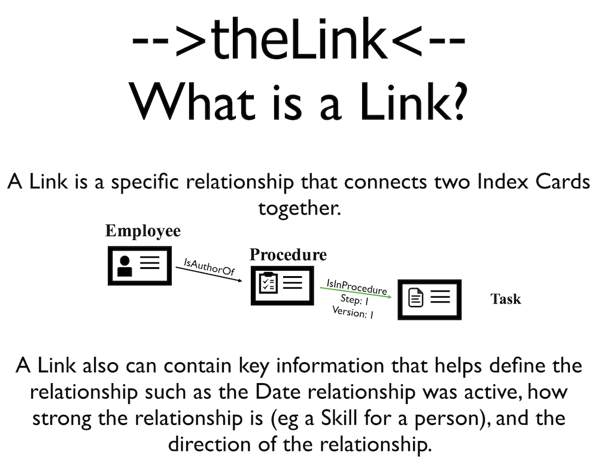

##Definitions: Index Cards and Relationships
       
 
**-->theLink<--** is made up of two key elements: **Index Cards** and **Relationships** between Index Cards.

   
An Index Card can also describe knowledge artifacts such as files, images, documents or reports, and provide links to those resources. 

## Relationships: 
   
**Index Cards** are connected together with **Relationships**. 

For Example:

* *Person is a Project Manager of a Project* is a type of relationship that would link a person to a project.
* *A Contact Works For a Company* links a contact to a company they work for
* *A Person has a Skill* links a person to a type of skill they have

These Relationships link Index Cards together to form a **Knowledge Web** of your business critical knowledge.
    

