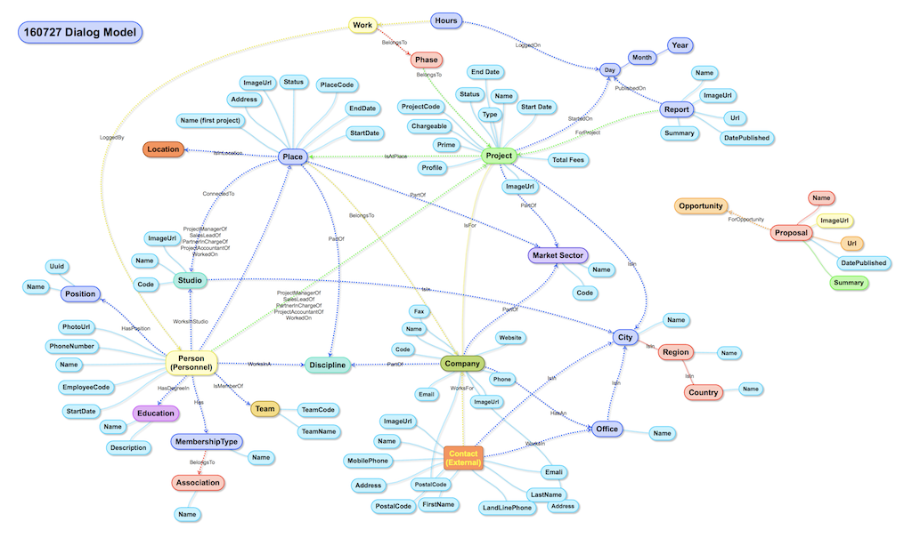

##The Knowledge Web:
The reason that Google search works as well as it does is because it indexes the World Wide Web. Google indexes billions of web pages and documents and accepts 5 billion queries per day. Those huge numbers and the hyperlinked nature of web pages make it possible for them to create the search experience they have. 

Business does not have an equivalent web: at least not one that can be seen or indexed. The Knowledge Web instead exists, but it in employees minds as they describe and store the knowledge they work with. 

This Knowledge Web must be created by by talking to people from teams around the business to find out how they classiy people, projects, files, customer business objects and documents they manage. 

The business entities are then mapped out and connected together to form a **Knowledge Web**:  

