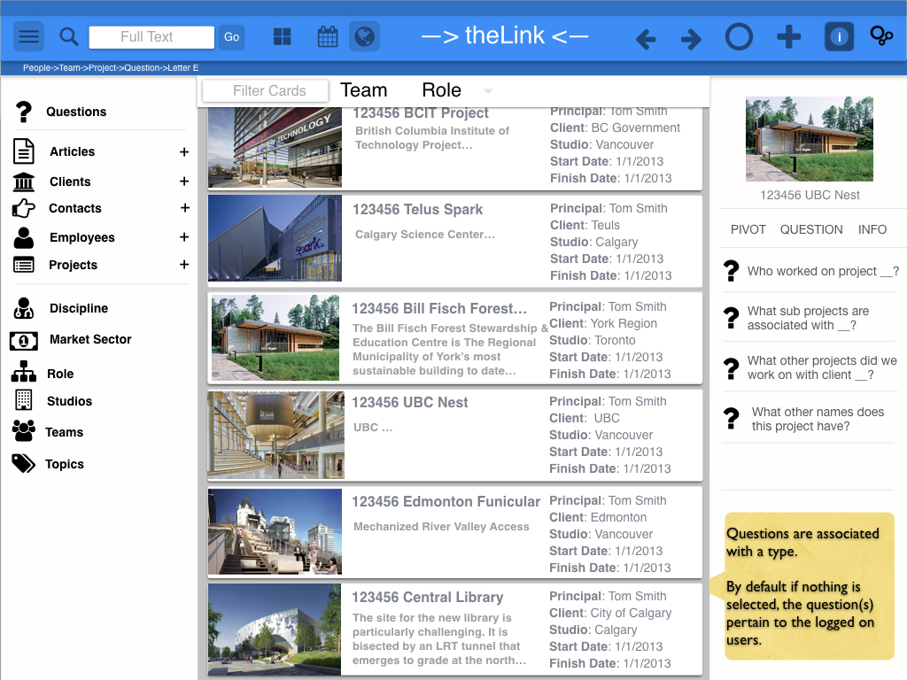

# Definitions: Pivots and Questions 

Key Parts Of -->theLink<--

Toolbar:

Index Card Explorer:

Relationship Browser: 

When you select an Index Card, -->theLink<-- will open the Relationship Browser panel on the right hand side of the application. 

A **Pivot** 

**Question:** describes a path through a series of Links between two Index Cards. 

