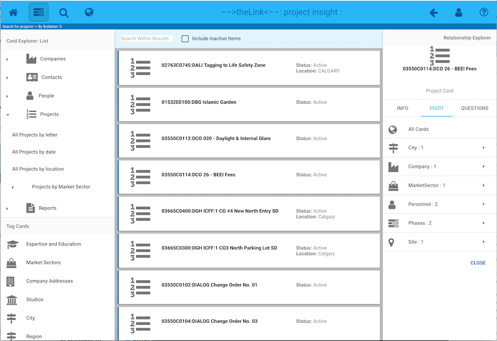
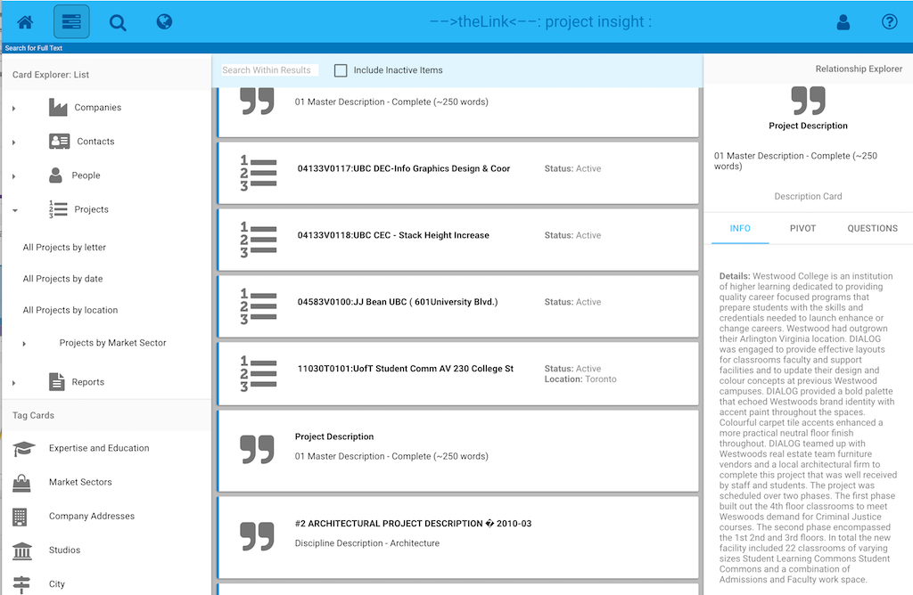
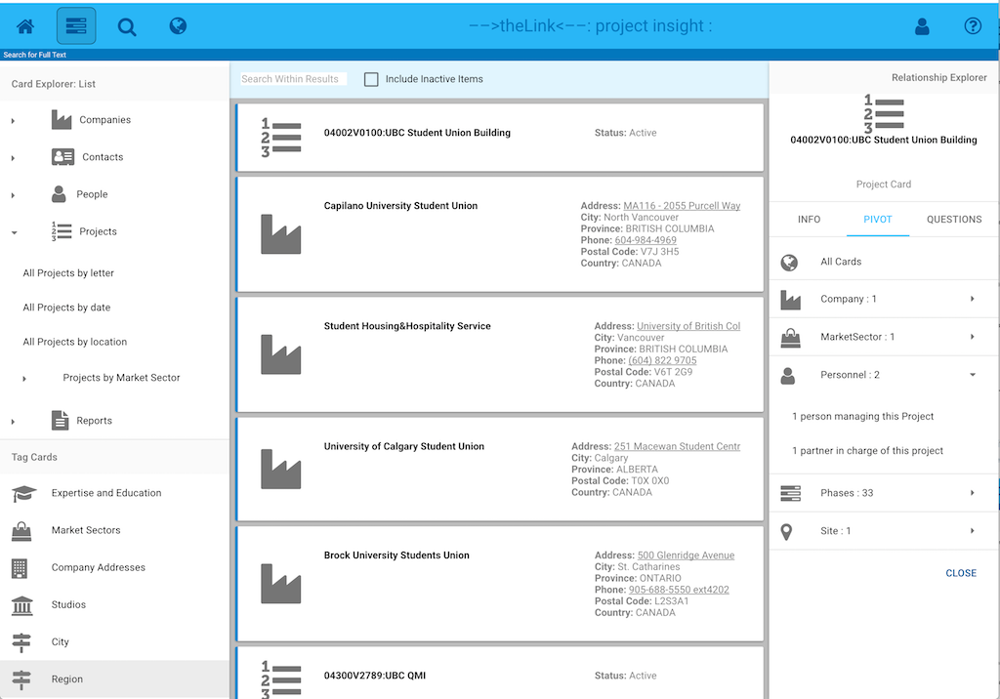
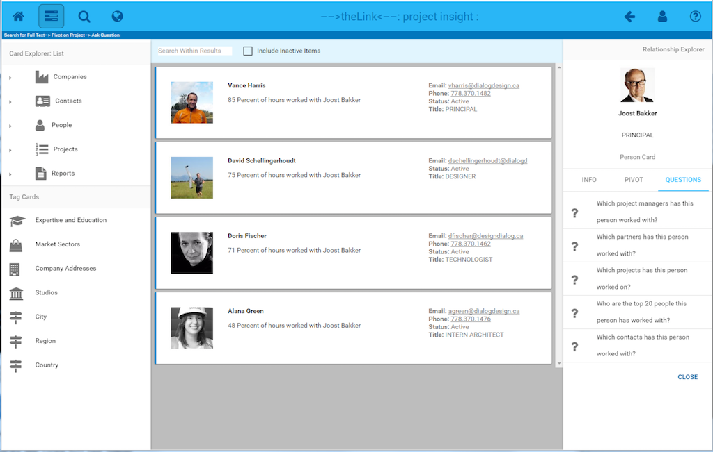

#### Link Explorer

The **Link Explorer** appears on the right hand side of -->theLink<-- when a card is selected. This tool shows at the top the currently selected card, and a set of Tabs:

* Info Tab: Shows detailed information about the currently selected card if any is available
* Pivot Tab: Shows types of Index Cards that are linked to the currently selected card
* Questions Tab: Shows a list of questions that you can have answered about the currently selected Index Card.

###### Info Tab: 

If there are additional details about the Index Card, such as descriptive text, links to external systems or docuemnts, it will be displayed here, as shown below:

###### Pivot Tab: 

The Pivot Tab is a powerful tool that allows you to navigate the links assocaited with the currently selected Index Card. 

When Pivot Tab is active, a list of link types are displayed. These show all the types of direct links have been made to the currently selected Index Card, and a count of the number of cards that are linked of that type. Selecting a Card Type will return the list of linked index cards.

Index cards can have more than one type of link associated with them. For example, a project might be linked to a person because they are a Project Manager of that Project. A person might also be a parnter on that project. Clicking on the Down Arrow beside the card type will show the type of links that exist:

 
##### Questions:

Questions are a powerful tool that allows deeper links to be explored. In -->thelink<-- if two cards are connected through a path, it is possible to answer questions about their relationship. For example:

**Who are the top 20 people this person has worked with?** is a question in which -->theLink<-- investigates the relationships between a person and through the work they do, figures out who else they have worked with based on their mutual project work. 

