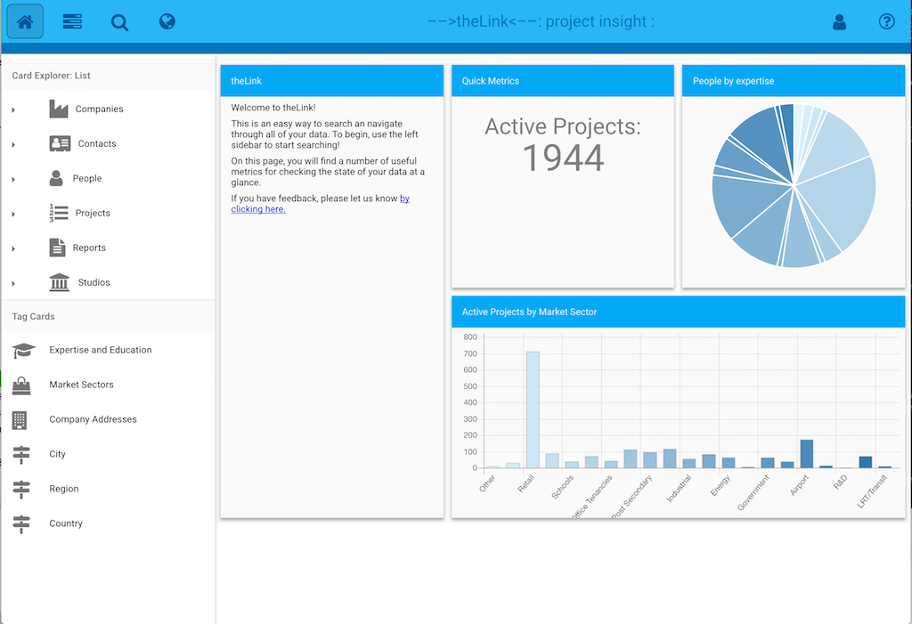
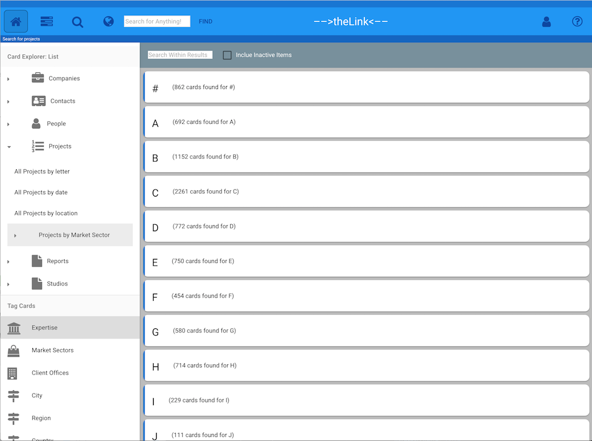
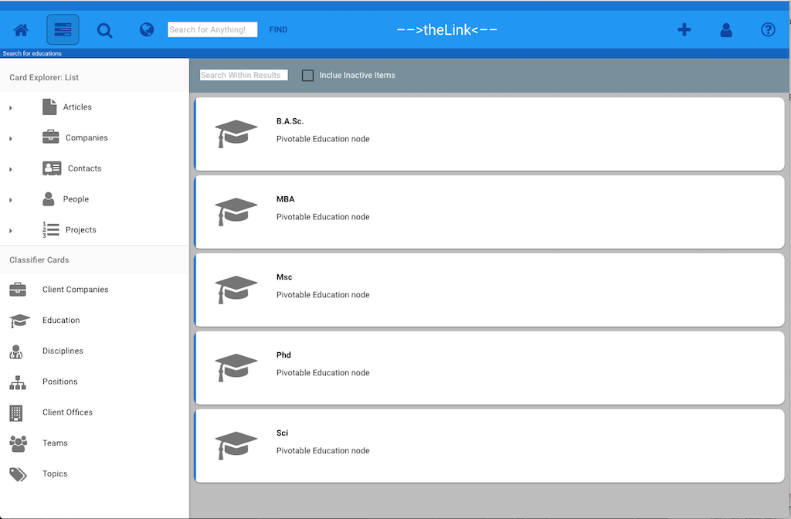

## Card Explorer

The Card Explorer section is the group of icons on the left side of the toolbar. 

These tools give you several paths thgrough which to find the Index Cards you are looking for. 

These are designed to function like the File Explorer you are used to, but improved in that they are able to provide a few different ways of getting to the knowledge you need quickly. 

####Home Button: 
The Home Button takes you back to the main page of **-->theLink<--** with the Dashboards. 

 
 
 The Dashboards show various metrics that answer questions about the knowledge stored in **-->theLink<--**. More questions can be added if needed. 

####Card Explorer Tools:

The **Card Explorer** is designed to help you find **Index Cards**. There are several types of Card Explorer tools to help you find of finding the cards you are looking for:

* **Card Explorer: List** : Find cards using a folder style drill-down
* **Card Explorer: Text** : Find cards by using their properties 
* **Card Explorer: Map**  : Find cards by their location using a map
* **Card Explorer: Name** : Find cards by using all or part of their name

####Card Explorer: List
 
Clicking the Card Explorer List Button will open the Card Explorer on the Left Side Menu. The top half of the Card Explorer shows a list of Index Card types such as Companies, Projects and People. 

Clicking on a card type will display collections that you can return cards by. Clicking on the Projects card type, will display a list of collections:

* **All Projects By Letter:** returns a list of projects grouped by letter with a count of the number of projects for that letter
* **All Projects By Date:** returns a list of projects  grouped by Year. Further refinment can be made to filter by Month and Day  
* **All Projects by Location:** returns a list of projects grouped by Country. Further refinement can be made to filter down to Region or City. 
* **Tag Cards:** the Card Explorer List tool can also display Tag Cards. This allows Index Cards to be return corrsponding to the Tag Card selected. 

#### Tag Cards: 

The bottom half of the Card Explorer shows a list of Tag Cards. 

These cards are tags that used to help classify Index or Content Cards. Clicking on a Tag Card will return a list of Tags associated with the Tag Card Group. 

Selecting a tag will display the **Link Explorer** that will show all Index Cards that are linked to the Tag Card. 

